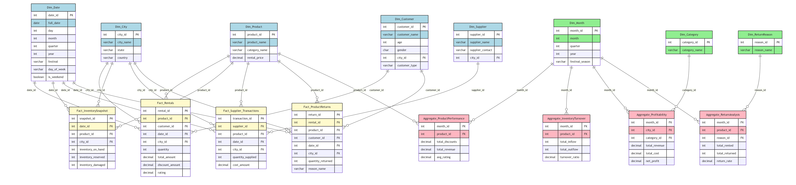

# 📦 Furlenco Data Warehouse Project

## 📘 Overview

This project presents a comprehensive data warehouse solution for a leading furniture rental company, **Furlenco**, designed to streamline decision-making across profitability, inventory, customer engagement, and supplier performance. The system follows **Kimball's dimensional modeling** principles using a **star schema architecture**, with extensive support for analytics via SQL and **Power BI visualizations**.

---

## 🎯 Objective

To empower the organization with a **centralized analytical repository** for data-driven insights and strategic business decisions, focusing on:

- Revenue and profit trends
- Inventory optimization
- Customer segmentation and engagement
- Supplier evaluation
- Return rate and product quality analysis

---

## 🏗️ Architecture

The system is structured around:
- **4 Fact Tables**: Rentals, Supplier Transactions, Product Returns, Inventory Snapshots
- **8+ Dimension Tables**: Customer, Product, City, Date, Category, Supplier, Return Reason, Month
- **4 Aggregate Tables**: Product Performance, Profitability, Inventory Turnover, Returns Analysis

Key features:
- **Granular Data**: Daily transactions and snapshots for fine-grained analysis
- **SCD Handling**: Type 1 & Type 2 slowly changing dimensions
- **Conformed Dimensions**: Shared dimensions across facts for unified reporting

---

## 🔍 Key Functionalities

### ✅ KPIs Tracked
- Revenue and profit margins (per product/category/city)
- Inventory turnover & damages
- Customer retention & satisfaction
- Supplier performance metrics
- Return rates & root cause analysis

### 📊 Analysis Areas
- Customer & Marketing
- Profit & Revenue
- Inventory & Supply Chain
- Product & Returns
- Growth & Forecasting

---

## 🔧 Technologies & Tools

- **SQL Server**: Star schema implementation and ETL pipeline
- **Power BI**: Dashboards for management and analytics teams
- **Python (Pandas, NumPy)**: Synthetic data generation
- **Excel & CSV**: Data exports and transformations

---

## 💡 Sample Insights via Queries

- Top cities by customer lifetime value
- High-discount products with poor ratings
- Year-on-year city-wise revenue growth
- High-return products despite high ratings

---

## 📈 Visualizations (Power BI)
- Discount vs. Revenue by category/month
- Return rate by category & reason
- City-wise ratings and revenue heatmaps
- Inventory turnover per category

---

## 🧪 Synthetic Data Generation

Implemented using Python with a modular script covering:

- Dimension creation (cities, dates, categories, products)
- Fact table simulation with realistic values
- Aggregate metric computation (monthly roll-ups)
- CSV export for downstream consumption

---

## 📚 References

- Kimball, R. – *The Data Warehouse Toolkit*
- Inmon, W.H. – *Building the Data Warehouse*
- SQL Server & Power BI Official Docs
- Python Pandas Documentatio
---